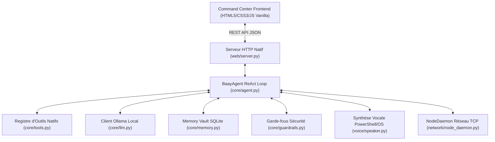

# 📿 BAAY-FAAL — Sovereign Engineering Operating System

> **Agent IA d'Ingénierie Autonome, Local & Souverain — Philosophie "Jëf Jël"**
> 
> *100% Python Standard Library (Vanilla First) — Boucle ReAct Local — Synthèse Vocale Natifs — Multi-Nœuds Sécurisés HMAC-SHA256*

---

## 🌟 Philosophie "Jëf Jël" & Directives d'Ingénierie

**BAAY-FAAL** est une plateforme d'ingénierie logicielle et un assistant autonome conçu selon les principes fondamentaux de la philosophie Baye Fall : **travail rigoureux, discipline inébranlable, persévérance ("Jëf Jël") et humilité par l'action concrète.**

* **Zéro Dépendance Tierce au Cœur (Vanilla First) :** Conçu à 100 % avec la bibliothèque standard Python (`urllib`, `sqlite3`, `subprocess`, `threading`, `socket`, `unittest`, `json`).
* **Souveraineté & Confidentialité Absolue :** 100 % local. Zéro fuite de données vers des services cloud tiers.
* **Verrouillage Monolangage (Anti-Dispersion) :** Progression séquentielle obligatoire. Maîtrise complète de Python (100 %) avant de déverrouiller la technologie suivante.

---

## 🛠️ Les 5 Piliers d'Ingénierie BAAY-FAAL

Le Command Center intègre 5 outils natifs à haute valeur ajoutée :

| Outil | Philosophie Baye Fall | Rôle & Mission |
| :--- | :--- | :--- |
| 🛠️ **JËF-JËL DOCTOR** | *Jëf Jël* (Action concrète) | **Analyseur & Correcteur de Bugs :** Lit les stack traces de crash, diagnostique l'erreur et génère le patch automatiquement. |
| ⚡ **TAK-JOUK GENERATOR** | *Tak-Jouk* (Se lever pour agir) | **Générateur & Refactoriseur Natif :** Crée du code Python modulable, typé et conforme à PEP 8 sans dépendance externe. |
| 🧹 **YITÉ CLEANER** | *Yité* (Soin et propreté) | **Gestionnaire de Processus & Cache :** Purge les fichiers `__pycache__`, tue les processus zombies et libère le port 8000. |
| 🧱 **NDIGËL SCAFFOLDER** | *Ndigël* (La directive) | **Générateur d'Architecture :** Produit en 3 secondes la structure complète d'un nouveau microservice (`main.py`, `Dockerfile`, `tests/`). |
| 🌐 **NJABOT DEPLOYER** | *Njabot* (La communauté de nœuds) | **Assistant Git & Déploiement Réseau :** Inspecte `git status`, formate les commits et orchestre la synchronisation distante sur les serveurs. |

---

## 🎓 Académie de Forge — "Apprendre Tech"

L'Académie d'Apprentissage active un système pédagogique en **2 étapes** :
1. **Étape 1 (Cours Flash) :** Théorie officielle Python, syntaxe de référence, pièges d'anti-patterns et analogies du monde réel.
2. **Étape 2 (Éditeur Vierge & Banc de Tests) :** Code vierge avec commentaires `TODO` et validation automatique par la suite de tests unitaires `unittest`.

### 📚 Curriculum (4 Modules x 3 Exercices = 12 Défis) :
* **Module 1 :** Fondations & Algorithmique (Types, Contrôle d'accès, Boucles)
* **Module 2 :** Structures de Données & POO (Dictionnaires, Classes, Héritage)
* **Module 3 :** I/O Fichiers & Système (Pathlib, JSON, Threading)
* **Module 4 :** Réseau & API REST Natif (Sockets, Sockets HTTP `http.server`, Moteur ReAct)

---

## 🏛️ Architecture Technique



---

## 🚀 Démarrage Rapide

### 1. Cloner le Dépôt
```bash
git clone https://github.com/Baay-Faal/baayfaalAI.git
cd baayfaalAI
```

### 2. Lancer le Command Center Web
```bash
python web/server.py
```
Accédez à l'interface web dans votre navigateur : **http://localhost:8000/**

### 3. (Optionnel) Activer le Modèle LLM Local Ollama
Dans un autre terminal :
```bash
ollama serve
ollama pull qwen2.5-coder:1.5b
```
> *Remarque : Si Ollama n'est pas démarré, l'Agent bascule automatiquement sur son **Moteur Souverain Natif** pour des réponses instantanées.*

---

## 🧪 Exécution de la Suite de Tests

Pour vérifier la conformité du système et des 26 tests unitaires :
```bash
python -m unittest discover tests
```

---

## 🛡️ Sécurité & Guardrails Policy

* **Commandes Bloquées à 100% :** `rm -rf /`, `format C:`, `del /s /q`, `DROP DATABASE`, `shutdown`.
* **Validation Humaine (Human-in-the-Loop) :** Confirmation préalable requise pour toute suppression de fichier ou arrêt de service.
* **Authentification Réseau :** Communication multi-nœuds signée par jeton cryptographique **HMAC-SHA256**.

---

## 📄 Licence & Crédits

Projet open-source développé sous philosophie **BAAY-FAAL**.
Créé pour la souveraineté technologique, la rigueur logicielle et la maîtrise absolue par la pratique.