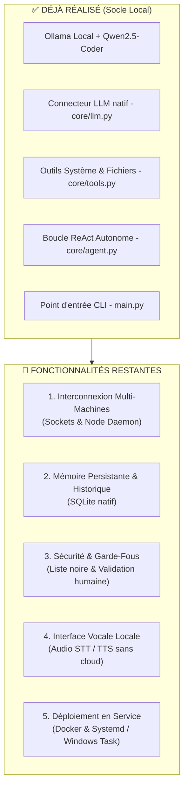

# 🗺️ ROADMAP & FONCTIONNALITÉS RESTANTES — BAAY-AGENT

> **Projet :** Agent IA Local Autonome & Souverain  
> **Philosophie :** *Jëf Jël* | 100% Hors-ligne | Vanilla Python (Zéro dépendance tierce)  
> **Statut actuel :** 🎉 **PROJET 100% FORGÉ ET VALIDÉ** (Phases 1, 2, 3, 4 et 5 achevées avec 19/19 tests unitaires verts).

---

## 📊 État des Lieux de la Forge



---

## 📌 Phase 1 : Interconnexion Réseau & Pilotage Multi-Machines *(Priorité Haute - P0)* — ✅ RÉALISÉE
*Objectif : Permettre à l'agent de commander à distance n'importe quelle autre machine de ton réseau local.*

- [x] **1.1. Démon de nœud distant (`network/node_daemon.py`)**
  - Script Python pur ultra-léger (1 seul fichier) à déposer sur les machines cibles (Linux, Windows, Raspberry Pi).
  - Écoute sur un port TCP local dédié (ex: port `9999`) via le module `socket`.
  - Exécute les ordres reçus et renvoie le flux de sortie (`stdout`, `stderr`, code retour).
- [x] **1.2. Sécurité & Authentification réseau**
  - Authentification par clé secrète partagée via le module natif `hmac` et `hashlib` (zéro transmission de mot de passe en clair).
- [x] **1.3. Outil de commande à distance pour l'Agent**
  - Ajout dans `core/tools.py` de l'outil `remote_command(node, command)`.
  - Intégration dans le schéma de décision de `core/agent.py`.
- [x] **1.4. Annuaire des machines (`config/nodes.json`)**
  - Fichier de configuration listant ton parc de machines :
    ```json
    {
      "serveur_linux": {"ip": "192.168.1.50", "port": 9999, "role": "Serveur Web"},
      "pc_bureau": {"ip": "192.168.1.120", "port": 9999, "role": "Calcul"}
    }
    ```
  - Commande possible : *"Agent, vérifie la mémoire disponible sur le serveur_linux"*.

---

## 📌 Phase 2 : Mémoire Long-Terme & Persistance Réseau (MySQL / XAMPP & SQLite) *(Priorité P1)* — ✅ RÉALISÉE
*Objectif : Stocker l'historique et la mémoire de l'agent dans MySQL (XAMPP) avec un mode hybride SQLite natif ultra-résilient.*

- [x] **2.1. Base de données MySQL XAMPP (`core/memory.py`)**
  - Serveur : MySQL / MariaDB via XAMPP (`localhost:3306`).
  - Base dédiée : `baay_agent_db`.
  - Tables principales :
    - `sessions` : ID de session, date, objectif initial, statut.
    - `actions_log` : Horodatage, outil appelé, paramètres, résultat.
    - `knowledge` : Faits appris par l'agent (adresses IP du parc, ports ouverts, préférences).
  - Consultation visuelle directe via **phpMyAdmin** (`http://localhost/phpmyadmin`).
- [x] **2.2. Mode Hybride (Repli SQLite si XAMPP est éteint)**
  - Si le service MySQL de XAMPP n'est pas démarré, l'agent bascule automatiquement sur une base locale `sqlite3` ([data/memory.db](file:///c:/Users/moust/Baay_Faal/data/memory.db)) de secours sans planter.
  - Outils `recall_memory` et `remember_fact` intégrés pour permettre à l'agent d'enregistrer et relire ses connaissances.

---

## 📌 Phase 3 : Sécurité, Garde-fous & Mode Human-in-the-Loop *(Priorité P1)* — ✅ RÉALISÉE
*Objectif : Empêcher l'agent d'exécuter des actions catastrophiques via le module core/guardrails.py.*

- [x] **3.1. Liste noire de commandes destructrices**
  - Blocage automatique immédiat de commandes critiques (`rm -rf /`, `format C:`, `del /s /q`, `DROP DATABASE`, `shutdown`).
- [x] **3.2. Validation humaine préalable (Human-in-the-Loop)**
  - Demande de confirmation interactive dans la console pour toute action sensible (`rm`, `del`, `systemctl stop`, `kill -9`) :
    > *« [ATTENTION GARDE-FOU] L'agent souhaite exécuter : `rm old_log.txt`. Confirmez-vous ? (o/N) »*

---

## 📌 Phase 4 : Interface Vocale Locale & Mains-Libres *(Priorité P2)* — ✅ RÉALISÉE
*Objectif : Piloter ton agent à la voix sans toucher au clavier et sans aucun service cloud payant.*

- [x] **4.1. Synthèse vocale locale (Text-to-Speech)**
  - Utilisation de la voix native du système d'exploitation via PowerShell `System.Speech` sous Windows (`voice/speaker.py`).
  - Lecture fluide des réponses de l'agent débarrassées des balises markdown/code.
- [x] **4.2. Reconnaissance vocale locale (Speech-to-Text)**
  - Module d'écoute et de capture de la parole (`voice/listener.py`).
- [x] **4.3. Déclencheur vocal ("Wake Word")**
  - Détection automatique des variantes du mot-clé : *"Baay-Faal"*, *"Baye Fall"*, *"Baay-Agent"*.

---

## 📌 Phase 5 : Déploiement Autonome & Daemonisation *(Priorité P2)* — ✅ RÉALISÉE
*Objectif : Laisser l'agent tourner 24h/24 comme un vrai membre d'équipe.*

- [x] **5.1. Démon Linux (`deployment/baay-agent.service`)**
  - Fichier de configuration `systemd` pour redémarrage automatique en cas de panne de la machine.
- [x] **5.2. Service Windows / Tâche planifiée (`deployment/install_windows_service.ps1`)**
  - Script PowerShell de lancement silencieux au démarrage de Windows.
- [x] **5.3. Conteneurisation Docker souveraine (`deployment/Dockerfile` & `deployment/docker-compose.yml`)**
  - Image Docker minimaliste (< 80 Mo) prête à être déployée sur n'importe quel serveur en une ligne.

---

## 🧭 Arborescence Cible Finale du Projet

```text
Baay_Faal/
│
├── core/
│   ├── agent.py          # Boucle ReAct autonome (Raisonner -> Agir)
│   ├── llm.py            # Connecteur natif Ollama (urllib + json)
│   ├── tools.py          # Outils locaux (terminal, fichiers, système)
│   ├── memory.py         # [À FAIRE] Persistance SQLite
│   └── guardrails.py     # [À FAIRE] Sécurité et validation des commandes
│
├── network/
│   ├── node_daemon.py    # [À FAIRE] Démon à poser sur les machines distantes
│   └── client.py         # [À FAIRE] Client réseau pour interroger les nœuds
│
├── voice/                # [À FAIRE] Modules audio locaux (STT / TTS)
│   ├── listener.py
│   └── speaker.py
│
├── config/
│   └── nodes.json        # [À FAIRE] Liste des machines connectées
│
├── main.py               # Interface CLI principale
└── ROADMAP.md            # Ce document de pilotage
```

---
*Document généré pour consultation directe dans **Antigravity IDE**.*
